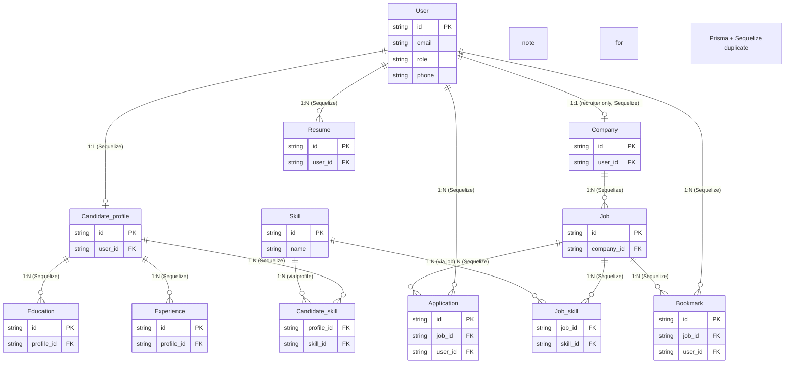

# JobConnect Recruitment System - Complete Project Documentation

---

## Part 1: Agent Guidelines (AGENTS.md)

# AGENTS.md - JobConnect Recruitment System Backend

## Build & Development Commands

```bash
# Install dependencies
npm install

# Run in development mode (with auto-reload)
npm run dev

# Run in production mode
npm start

# Database commands
npm run db:push          # Push schema changes to database
npm run db:migrate       # Run migrations
npm run generate         # Generate Prisma client
npm run studio            # Open Prisma Studio on port 8888

# Testing (currently not configured)
npm test                  # Currently echoes error - no test framework set up

# To run a single test file (once tests are added):
# node --test path/to/test.test.js
```

## Code Style Guidelines

### Language & Imports
- **JavaScript** (CommonJS) using `require()` / `module.exports`
- No TypeScript in source files (despite tsconfig.json existing for tooling)
- Group imports: Node built-ins → npm packages → local modules
- Use relative paths for local imports: `require('../services/authService')`

### Naming Conventions
- **Files**: Use camelCase with inconsistencies allowed (e.g., `authController.js`, `ResumeService.js`, `candidate_Routes.js`)
- **Variables/functions**: camelCase (`full_name`, `accessToken`, `matchPassword`)
- **Database columns**: snake_case in models (`full_name`, `avatar_url`, `created_at`)
- **Constants**: UPPER_SNAKE_CASE (`ROLES` in `src/constants/roles.js`)
- **Classes/Models**: PascalCase (`User`, `Company`, `Candidate_profile`)

### Architecture Pattern
Follow the **Controller-Service-Model** layered architecture:
- `src/controllers/` - HTTP request handlers, input extraction, response formatting
- `src/services/` - Business logic, validation, database operations
- `src/models/` - Sequelize model definitions with hooks and instance methods
- `src/routes/` - Express route definitions
- `src/middleware/` - Auth, upload handlers, request processing
- `src/config/` - Database config, multer configs
- `src/utils/` - Token utilities, helpers
- `src/constants/` - Role definitions, enums

### Error Handling
- Use try-catch blocks in controllers and services
- Throw errors with Vietnamese messages: `throw new Error('Email đã được sử dụng')`
- Return appropriate HTTP status codes:
  - `400` for validation errors
  - `401` for authentication failures
  - `403` for authorization failures
  - `500` for server errors
- Controller pattern:
```javascript
try {
    const result = await service.method(data);
    return res.status(200).json({ status: 'success', data: result });
} catch (error) {
    console.error(error);
    if (error.message === 'Specific error') {
        return res.status(400).json({ message: error.message });
    }
    res.status(500).json({ message: 'Lỗi server', error: error.message });
}
```

### Database & ORM
- PostgreSQL with **Sequelize** ORM
- **Prisma** used for schema management (`prisma.config.ts`)
- Model definitions in `src/models/` with `sequelize.define()`
- Use UUID for primary keys: `type: DataTypes.UUID, defaultValue: DataTypes.UUIDV4`
- Timestamps: `createdAt: 'created_at', updatedAt: 'updated_at'`
- Hooks for password hashing in `beforeCreate` and `beforeUpdate`
- Instance methods added to `Model.prototype` (e.g., `matchPassword`)

### Authentication
- JWT-based with access/refresh token pattern
- Tokens stored in database (`refresh_token` field)
- Auth middleware: `protect` (verify JWT) and `authorize` (check roles)
- Roles defined in `src/constants/roles.js`: `CANDIDATE`, `RECRUITER`, `ADMIN`

### Validation
- Input validation in **service layer** (not controllers)
- Use regex patterns for format validation
- Sequelize model validations for schema-level checks
- Trim inputs: `data.email?.trim()`

### Response Format
```javascript
// Success
res.status(200).json({ status: 'success', data: result })

// Error
res.status(400).json({ message: 'Error message' })
```

### Environment & Security
- Use `dotenv` for environment variables
- Never commit `.env` files
- Password hashing with `bcryptjs` (salt: 10 rounds)
- Helmet for security headers, CORS enabled, rate limiting with `express-rate-limit`
- Static file serving: `app.use('/uploads', express.static(...))`

### File Uploads
- `multer` for handling multipart/form-data
- Configs in `src/config/multer.js`
- Middleware in `src/middleware/` (`uploadAvatar.js`, `uploadResumes.js`, `logoCompany.js`)
- Image processing with `sharp`

### Notes for Agents
- Server entry point: `server.js` (not `src/index.js`)
- Database sync with `sequelize.sync({ alter: true })` on startup
- No linting or formatting tools configured - maintain consistency manually
- Comments in codebase are bilingual (Vietnamese and English)
- When adding new features, follow existing controller-service-model pattern

---

## Part 2: Unified Data Architecture Analysis

### 1. Unified Data Schema Table
| Entity Name | Source (Prisma/Folder) | Key Attributes | Purpose |
| :--- | :--- | :--- | :--- |
| User | Both (Prisma: `users`; Folder: `User.js`) | `id` (UUID), `email`, `password`, `full_name`, `role`, `phone`, `refresh_token` | Core user account management, authentication, role-based access control |
| Candidate Profile | Both (Prisma: `candidate_profiles`; Folder: `Candidate_profile.js`) | `id`, `user_id`, `headline`, `bio`, `linkedin_url` | Stores candidate-specific profile metadata |
| Company | Both (Prisma: `companies`; Folder: `Company.js`) | `id`, `user_id`, `name`, `description`, `status`, `logo_url` | Stores recruiter company details, approval workflow |
| Job | Both (Prisma: `jobs`; Folder: `Job.js`) | `id`, `company_id`, `title`, `salary_min/max`, `status`, `deadline` | Job posting management, searchable job listings |
| Application | Both (Prisma: `applications`; Folder: `Application.js`) | `id`, `job_id`, `user_id`, `cv_url`, `status` | Tracks job applications, candidate-recruiter interaction |
| Resume | Both (Prisma: `resumes`; Folder: `Resume.js`) | `id`, `user_id`, `file_url`, `is_default` | Stores candidate resume files and metadata |
| Bookmark | Both (Prisma: `bookmarks`; Folder: `Bookmark.js`) | `id`, `user_id`, `job_id` | Candidate job bookmarking functionality |
| Skill | Both (Prisma: `skills`; Folder: `Skill.js`) | `id`, `name` (unique) | Master list of skills for candidates and jobs |
| Candidate Skill | Both (Prisma: `candidate_skills`; Folder: `Candidate_skill.js`) | `profile_id`, `skill_id` (composite PK) | Links candidates to their skills (N:N mapping) |
| Job Skill | Both (Prisma: `job_skills`; Folder: `Job_skill.js`) | `job_id`, `skill_id` (composite PK) | Links jobs to required skills (N:N mapping) |
| Education | Both (Prisma: `educations`; Folder: `Education.js`) | `id`, `profile_id`, `school_name`, `degree` | Candidate education history |
| Experience | Both (Prisma: `experiences`; Folder: `Experience.js`) | `id`, `profile_id`, `company_name`, `position` | Candidate work experience history |

### 2. Relational Connectivity Map (Unified)
All enforced relations exist in the **Sequelize layer** (`src/models/index.js` associations); Prisma schema has no `@relation` definitions, only raw foreign key fields.

- [User] --(1:1)--> [Candidate_profile] (Sequelize: `User.hasOne(Candidate_profile)`; links user to candidate profile)
- [User] --(1:1)--> [Company] (Sequelize: `User.hasOne(Company)`; links recruiter user to company)
- [User] --(1:N)--> [Resume] (Sequelize: `User.hasMany(Resume)`; one user can have multiple resumes)
- [User] --(1:N)--> [Application] (Sequelize: `User.hasMany(Application)`; user applies to multiple jobs)
- [Job] --(1:N)--> [Application] (Sequelize: `Job.hasMany(Application)`; job receives multiple applications)
- [Job] --(1:N)--> [Bookmark] (Sequelize: `Job.hasMany(Bookmark)`; job can be bookmarked by multiple users)
- [User] --(1:N)--> [Bookmark] (Sequelize: `User.hasMany(Bookmark)`; user bookmarks multiple jobs)
- [Candidate_profile] --(1:N)--> [Candidate_skill] (Sequelize: `Candidate_profile.hasMany(Candidate_skill)`)
- [Candidate_profile] --(1:N)--> [Education] (Sequelize: `Candidate_profile.hasMany(Education)`)
- [Candidate_profile] --(1:N)--> [Experience] (Sequelize: `Candidate_profile.hasMany(Experience)`)
- [Job] --(1:N)--> [Job_skill] (Sequelize: `Job.hasMany(Job_skill)`)
- [Company] --(1:N)--> [Job] (Sequelize: `Company.hasMany(Job)`; company posts multiple jobs)

**Virtual Relationships (Prisma only)**: Prisma models contain foreign key fields (`job_id`, `user_id`, `profile_id`) with no relation enforcement, so these are "virtual" in Prisma but enforced in Sequelize.

### 3. Integrated ER Diagram (Mermaid.js)


### 4. Architectural Observations
#### Redundancy
- **Full model duplication**: Every entity is defined twice (Prisma `schema.prisma` + Sequelize `src/models/*.js`), creating 2x maintenance overhead. Schema changes must be synced across both layers manually.
- **Unused Prisma Client**: The Prisma generator outputs to `src/generated/prisma`, but no codebase files import the Prisma client. All data access uses Sequelize models, making Prisma only useful for database schema management (`db:push`, `db:migrate`).

#### Separation of Concerns
- Unclear hybrid purpose: Prisma is used as a schema management tool, while Sequelize is the runtime ORM. This creates confusion for new contributors.
- No DTOs in `/models`: The `src/models/` folder contains Sequelize ORM models only, not Data Transfer Objects or wrappers. The "hybrid" approach is not leveraging Prisma for query logic.

#### Conflicts & Inconsistencies
- **Naming mismatch**: Prisma uses plural snake_case (`candidate_profiles`, `job_skills`), while Sequelize uses singular PascalCase (`Candidate_profile`, `Job_skill`).
- **Missing Prisma relations**: Prisma schema has no `@relation` definitions, so foreign key relationships are only enforced in Sequelize.
- **Attribute drift risk**: If a field is added to Prisma but not Sequelize (or vice versa), the database and runtime models will desync.

#### Recommendation
Migrate fully to either Prisma (replace Sequelize) or Sequelize (remove Prisma) to eliminate redundancy. If keeping the hybrid approach, document which layer is authoritative for schema changes.

---

## Appendices

### Appendix A: Prisma Schema (prisma/schema.prisma)
```prisma
generator client {
  provider = "prisma-client"
  output   = "../src/generated/prisma"
}

datasource db {
  provider = "postgresql"
  url      = env("DATABASE_URL")
}

model applications {
  id                String    @id @default(uuid()) @db.Uuid
  job_id            String    @db.Uuid
  user_id           String    @db.Uuid
  cv_url            String?   @db.VarChar(255)
  cover_letter      String?
  status            String?   @default("submitted") @db.VarChar(255)
  note_by_recruiter String?
  applied_at        DateTime? @db.Timestamptz(6)
  updated_at        DateTime  @db.Timestamptz(6)
}

model bookmarks {
  id        String   @id @default(uuid()) @db.Uuid
  user_id   String   @db.Uuid
  job_id    String   @db.Uuid
  createdAt DateTime @db.Timestamptz(6)
  updatedAt DateTime @db.Timestamptz(6)
}

model candidate_profiles {
  id           String    @id @default(uuid()) @db.Uuid
  user_id      String    @db.Uuid
  headline     String?   @default("Chưa cập nhật") @db.VarChar(255)
  bio          String?
  website      String?   @db.VarChar(255)
  linkedin_url String?   @db.VarChar(255)
  deleted_at   DateTime? @db.Timestamptz(6)
  created_at   DateTime  @db.Timestamptz(6)
  updated_at   DateTime  @db.Timestamptz(6)
  deletedAt    DateTime? @db.Timestamptz(6)
}

model candidate_skills {
  profile_id String @db.Uuid
  skill_id   String @db.Uuid

  @@id([profile_id, skill_id])
}

model companies {
  id               String   @id @default(uuid()) @db.Uuid
  name             String   @db.VarChar(255)
  description      String?
  website          String?  @db.VarChar(255)
  logo_url         String?  @db.VarChar(255)
  address          String?  @db.VarChar(255)
  city             String?  @db.VarChar(255)
  size             String?  @db.VarChar(255)
  status           String?  @default("pending") @db.VarChar(255)
  rejection_reason String?
  user_id          String   @db.Uuid
  created_at       DateTime @db.Timestamptz(6)
  updated_at       DateTime @db.Timestamptz(6)
}

model educations {
  id          String    @id @default(uuid()) @db.Uuid
  profile_id  String    @db.Uuid
  school_name String    @db.VarChar(255)
  degree      String?   @db.VarChar(255)
  start_date  DateTime? @db.Date
  end_date    DateTime? @db.Date
  createdAt   DateTime  @db.Timestamptz(6)
  updatedAt   DateTime  @db.Timestamptz(6)
}

model experiences {
  id           String    @id @default(uuid()) @db.Uuid
  profile_id   String    @db.Uuid
  company_name String    @db.VarChar(255)
  position     String    @db.VarChar(255)
  start_date   DateTime  @db.Date
  end_date     DateTime? @db.Date
  description  String
  createdAt    DateTime  @db.Timestamptz(6)
  updatedAt    DateTime  @db.Timestamptz(6)
}

model job_skills {
  job_id   String @db.Uuid
  skill_id String @db.Uuid

  @@id([job_id, skill_id])
}

model jobs {
  id               String    @id @default(uuid()) @db.Uuid
  company_id       String    @db.Uuid
  title            String    @db.VarChar(255)
  description      String?
  requirements     String?
  benefits         String?
  salary_min       Int?
  salary_max       Int?
  location         String?   @db.VarChar(255)
  job_type         String?   @db.VarChar(255)
  job_level        String?   @db.VarChar(255)
  status           String?   @default("pending") @db.VarChar(255)
  rejection_reason String?
  deadline         DateTime? @db.Timestamptz(6)
  views_count      Int?      @default(0)
  createdAt        DateTime  @db.Timestamptz(6)
  updatedAt        DateTime  @db.Timestamptz(6)
}

model resumes {
  id         String   @id @default(uuid()) @db.Uuid
  user_id    String   @db.Uuid
  file_name  String   @db.VarChar(255)
  file_url   String   @db.VarChar(255)
  file_size  Int?
  is_default Boolean? @default(false)
  created_at DateTime @db.Timestamptz(6)
  updated_at DateTime @db.Timestamptz(6)
}

model skills {
  id   String @id @default(uuid()) @db.Uuid
  name String @unique @db.VarChar(255)
}

model users {
  id            String   @id @default(uuid()) @db.Uuid
  email         String   @unique @db.VarChar(255)
  password      String   @db.VarChar(255)
  full_name     String?  @db.VarChar(255)
  role          String?  @default("candidate") @db.VarChar(255)
  avatar_url    String?  @db.VarChar(255)
  phone         String   @unique @db.VarChar(255)
  refresh_token String?
  is_active     Boolean? @default(true)
  created_at    DateTime @db.Timestamptz(6)
  updated_at    DateTime @db.Timestamptz(6)
}
```

### Appendix B: Models Directory Structure (src/models/)
```
Application.js
Bookmark.js
Candidate_profile.js
Candidate_skill.js
Company.js
Education.js
Experience.js
index.js
Job_skill.js
Job.js
Resume.js
Skill.js
User.js
```

---

*Generated on: 2026-05-01*
*Project: JobConnect Recruitment System Backend*
